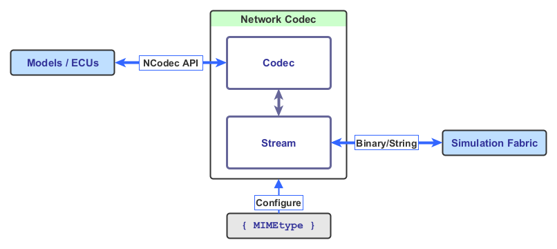

<!--
Copyright 2025 Robert Bosch GmbH

SPDX-License-Identifier: Apache-2.0
-->

# Dynamic Simulation Environment - Network Codec Library

[](https://github.com/boschglobal/dse.ncodec/actions/workflows/ci.yaml)
[](https://github.com/boschglobal/dse.ncodec/actions/workflows/super-linter.yml)


* [Architecture Overview](#architecture-overview)
* [Simplified API Example](#api-example)
* [Project Structure](#architecture-overview)
* Examples:
  * [Generalised example of Codec API Interfaces](dse/ncodec/examples/codec/README.md)
  * [Integration for AB Codec with PDU Stream and FMI 2 String Variables](dse/ncodec/examples/ab-codec-fmi/README.md)
* Codecs:
  * [AB Codec - PDU & Frame Schemas with Stream Interfaces; for Automotive Bus Networks](#automotive-bus-codec)
* Integrations:
  * [DSE Model C - AB Codec with custom stream implementation](https://github.com/boschglobal/dse.modelc/blob/main/dse/modelc/model/ncodec.c) (additional [trace](https://github.com/boschglobal/dse.modelc/blob/main/dse/modelc/model/trace.c) code)
  * [DSE FMI - AB Codec with specialised integration and tracing support](https://github.com/boschglobal/dse.fmi/blob/main/dse/fmu/ncodec.c)


## Introduction

The Network Codec Library of the Dynamic Simulation Environment (DSE) Core
Platform provides a solution for exchanging of Network Messages in simulations.
The MIMEtype based mechanism can be used to exchange any kind of binary
data between models in a simulation.

A Codec implementation representing the [Automotive Bus
Schema](https://github.com/boschglobal/automotive-bus-schema/blob/main/schemas/stream/frame.fbs)
is included with the library, as well as supporting [API
documentation](https://boschglobal.github.io/dse.doc/apis/ncodec).


### Architecture Overview




### API Example

```c
void do_network(NCODEC* nc) {
    NCodecCanMessage   msg = {};

    /* Message RX. */
    while (1) {
        if (ncodec_read(m->nc, &msg) < 0) break;
        put_rx_frame_to_queue(msg.frame_id, msg.buffer, msg.len);
    }
    ncodec_truncate(m->nc); /* Clear the stream buffer. */

    /* Message TX. */
    while (get_tx_frame_from_queue(&msg.frame_id, &msg.buffer, &msg.len)) {
        ncodec_write(m->nc, &msg);
    }
    ncodec_flush(m->nc); /* Finalise the stream buffer. */
}

```


### Project Structure

```text
doc/                        <-- Documentation including generated content.
dse
└── ncodec
    └── codec/ab
    │   ├── codec.c         <-- Automotive-Bus (AB) Codec implementation.
    │   ├── codec.h         <-- Automotive-Bus (AB) Codec headers.
    │   ├── frame_fbs.c     <-- Frame stream (CAN w. Flatbuffers encoding).
    │   └── pdu_fbs.c       <-- PDU stream (CAN/FlexRay/IP/SOMEIP w. Flatbuffers encoding).
    ├── examples
    │   └── codec/          <-- Codec example (generic API implementation).
    │   └── ab-codec-fmi/   <-- AB Codec basis integration for FMI (esp. FMI 2).
    │   └── flexray/        <-- AB Codec FlexRay interface and virtual bus.
    ├── schema
    │   └── abs/            <-- Automotive-Bus-Schema generated code.
    ├── stream
    │   └── buffer.c        <-- Buffer based stream implementation.
    ├── codec.c             <-- NCodec API implementation.
    └── codec.h             <-- NCodec API headers.
extra
└── external/               <-- External library build infrastructure.
licenses/                   <-- Third Party Licenses.
tests
└── cmocka
    └── codec/ab/           <-- Automotive-Bus Codec unit tests.
Makefile                    <-- Repo level Makefile.
```


## Usage

The Network Codec Library is a source code only library designed to be integrated
directly into codebases. In general an integration requires the following elements:

* NCodec API - User API, includes the NCodec API methods and abstract types.
* Codec(s) - Codec implementations, typically based upon a published schema.
* Streams(s) - Stream implementations supporting the simulation fabric.

An integration of the Network Codec Library, and its included Automotive Bus
Codec, is available in the [__DSE Model C
Library__](https://github.com/boschglobal/dse.modelc) (file:
[ncodec.c](https://github.com/boschglobal/dse.modelc/blob/main/dse/modelc/model/ncodec.c))
which includes a stream implementation supporting the Model C Simulation Bus,
and in implementation of the `ncodec_open()` method (which completes the NCodec
API). A custom trace implementation is also available (file:
[trace.c](https://github.com/boschglobal/dse.modelc/blob/main/dse/modelc/model/trace.c)).
An [example](https://github.com/boschglobal/dse.modelc/tree/main/dse/modelc/examples/ncodec)
is also provided.

This integration is also packaged and available in the [__DSE FMI Library__](https://github.com/boschglobal/dse.fmi),
supporting both FMI 2 and FMI 3 simulation environments. [Examples](https://github.com/boschglobal/dse.fmi/tree/main/dse/examples/fmu/network) are also provided.


## Automotive Bus Codec

Implementation of Network Codec supporting the
[Automotive Bus Stream](https://github.com/boschglobal/automotive-bus-schema/blob/main/schemas/stream/frame.fbs).
interface schema.


### PDU Schema

MIME Type
: application/x-automotive-bus; interface=stream; type=pdu; schema=fbs

Flatbuffers file identifier
: SPDU


#### CAN Bus

MIME Type (minimal)
: application/x-automotive-bus; interface=stream; type=pdu; schema=fbs

MIME Type (extended)
: application/x-automotive-bus; interface=stream; type=pdu; schema=fbs; swc_id=1; ecu_id=2


#### Additional Properties

The following parameters can be encoded directly in the MIME Type string
or set with calls to `ncodec_config()`.

| Property | Type | Default |
| --- |--- |--- |
| swc_id | uint8_t | 0 (must be set for normal operation [^1]) |
| ecu_id | uint8_t | 0 |

[^1]: Message filtering on `swc_id` (i.e. filter if Tx Node = Rx Node) is
only enabled when this parameter is set.


### Frame Schema

MIME Type
: application/x-automotive-bus; interface=stream; type=frame; schema=fbs

Flatbuffers file identifier
: SFRA

#### CAN Bus

MIME Type (minimal)
: application/x-automotive-bus; interface=stream; type=frame; bus=can; schema=fbs

MIME Type (extended)
: application/x-automotive-bus; interface=stream; type=frame; bus=can; schema=fbs; bus_id=1; node_id=2; interface_id=3

#### Additional Properties

The following parameters can be encoded directly in the MIME Type string
or set with calls to `ncodec_config()`.

| Property | Type | Default |
| --- |--- |--- |
| bus_id | uint8_t | 0 |
| node_id | uint8_t | 0 (must be set for normal operation [^2]) |
| interface_id | uint8_t | 0 |

[^2]: Message filtering on `node_id` (i.e. filter if Tx Node = Rx Node) is
only enabled when this parameter is set.


## Build

```bash
# Get the repo.
$ git clone https://github.com/boschglobal/dse.ncodec.git
$ cd dse.ncodec

# Optionally set builder images.
$ export GCC_BUILDER_IMAGE=ghcr.io/boschglobal/dse-gcc-builder:main

# Build.
$ make

# Run tests.
$ make test

# Update source files (pull in changes).
$ make update

# Generate documentation.
$ make generate

# Remove (clean) temporary build artifacts.
$ make clean
$ make cleanall
```


## Contribute

Please refer to the [CONTRIBUTING.md](./CONTRIBUTING.md) file.


## License

Dynamic Simulation Environment Network Codec Library is open-sourced under the Apache-2.0 license.

See the [LICENSE](LICENSE) and [NOTICE](./NOTICE) files for details.


### Third Party Licenses

[Third Party Licenses](licenses/)
